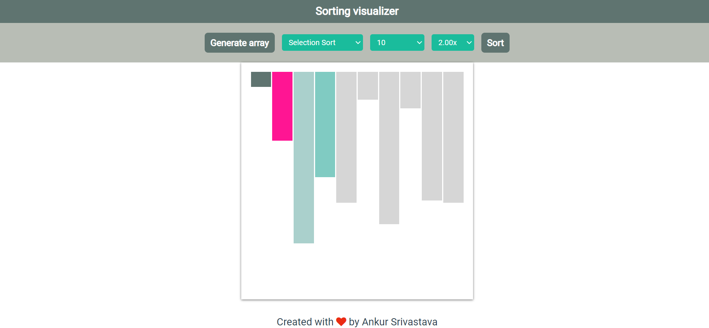

# Sorting_Visualizer
 

This web application is designed to visually demonstrate the inner workings of classic sorting algorithms using HTML, CSS, and JavaScript. It offers an interactive and educational platform to understand how different sorting techniques operate by watching them in action.

## 🚀 Live Demo
[Sorting Visualizer](#) 

## 💻 Source Code
[Sort Visualizer Code](#)

## 📌 Purpose

The primary goal of this project is to strengthen my web development skills in **HTML, CSS, and JavaScript** while creating a useful tool for beginners to learn about sorting algorithms. By visualizing these algorithms, users can gain a deeper understanding of their behavior, efficiency, and the concept of algorithmic sorting.

## 📊 Supported Sorting Algorithms

This application currently supports the following sorting algorithms:

- **🔄 Bubble Sort**: Repeatedly swaps adjacent elements if they are in the wrong order.
- **📍 Insertion Sort**: Builds the sorted array one element at a time by repeatedly picking the next item and inserting it into its correct position.
- **🔍 Selection Sort**: Repeatedly finds the minimum element and places it at the beginning of the unsorted portion.
- **⚡ Merge Sort**: A divide-and-conquer algorithm that recursively divides the array into halves, sorts, and then merges them back together.
- **⚡ Quick Sort**: A highly efficient, in-place sorting algorithm that uses partitioning to sort elements.

## 🛠️ How It Works

1. **Generate Array**: Users can generate a random array of numbers to be sorted.
2. **Select Algorithm**: Choose the desired sorting algorithm from the dropdown menu.
3. **Adjust Speed**: Control the speed of the visualization for better observation.
4. **Sort**: Watch the chosen sorting algorithm in action as it sorts the array step-by-step.

## 🌟 Features

- **Interactive Visuals**: Observe sorting algorithms dynamically sorting arrays with real-time animations.
- **Customizable Settings**: Change array size and sorting speed to suit your learning pace.
- **Educational Tool**: Perfect for beginners to get a visual intuition for how different sorting algorithms work.

## 📈 Benefits

- Enhances understanding of sorting algorithms through visual learning.
- Helps beginners bridge the gap between theoretical knowledge and practical implementation.
- Provides a fun and engaging way to study algorithms.
